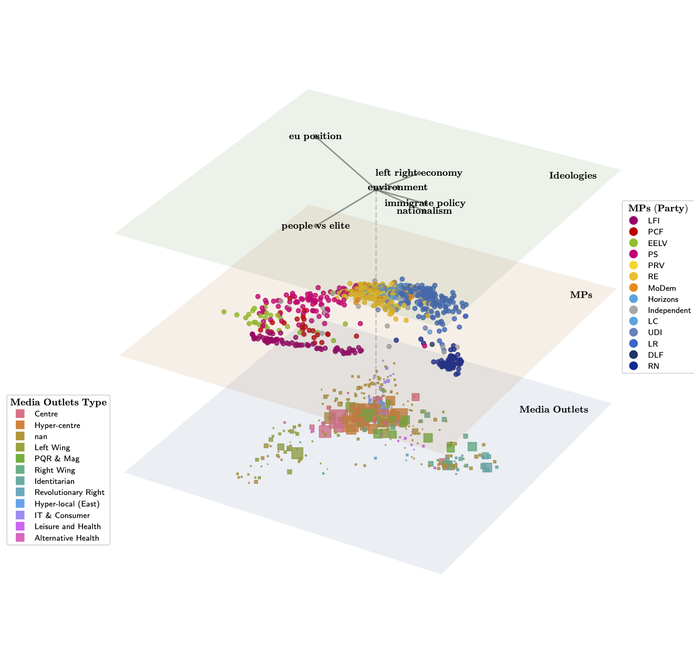
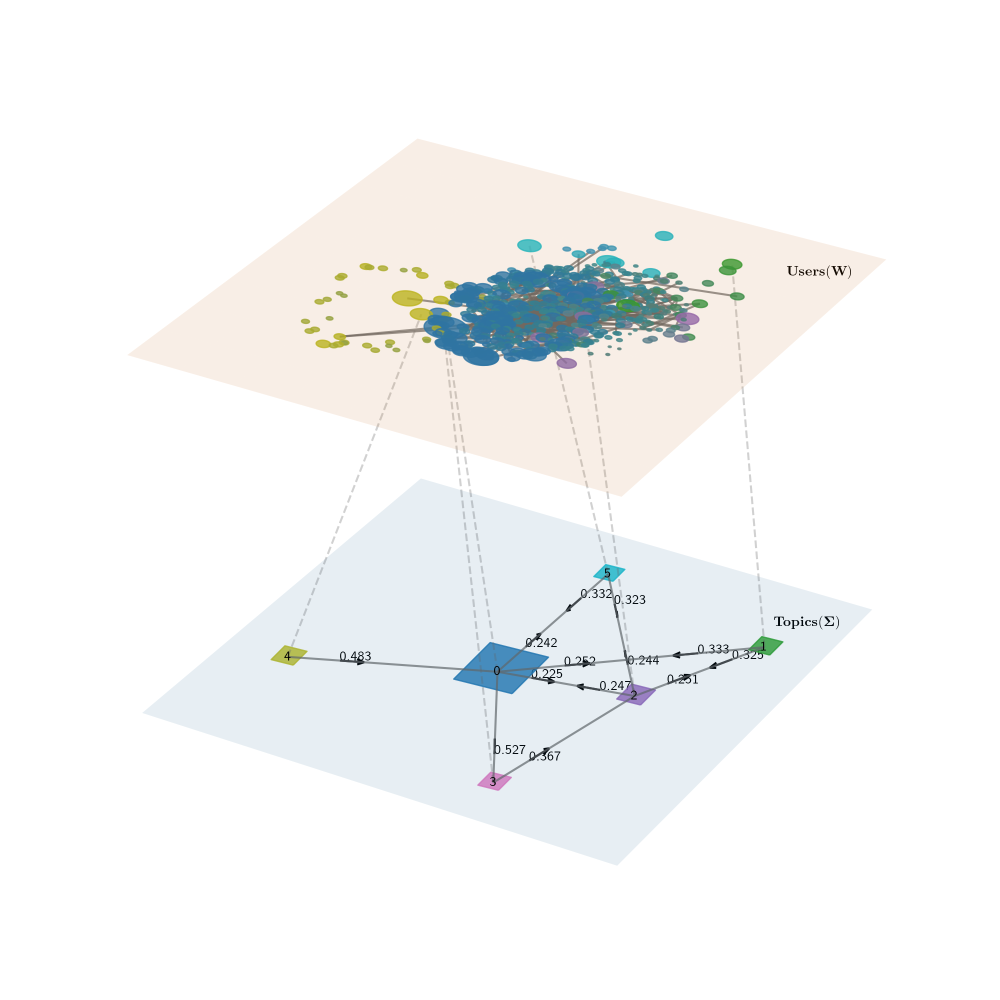

# MultiLayerNetViz

MultiLayerNetViz is a lightweight Python toolkit for visualizing and analyzing multi-layer networks, with a focus on the study of interacting social and semantic networks. This repository provides a Jupyter notebook and a Python function file to visualize multi-layer networks, particularly useful for understanding complex relationships in social media data. It was initially built to qualitatively analyze the results in [1].

Social network visualization of tweets of Members of the French Parliament (MPS) and media domains, projected onto an opinion space.

## Features

- **Multi-layer network visualization**: Display multiple interconnected graphs (e.g., users and topics) in a single 3D plot.
- **Customizable layouts**: Node positions are computed using a combination of spring layouts and alignment matrices.
- **Node and edge annotations**: Nodes and edges can be labeled and colored based on network properties.
- **Interactive plotting**: Uses `matplotlib` with widget support for interactive exploration.
## Main Components

### Notebook: `Visu_network_clean.ipynb`

This Jupyter notebook demonstrates the visualization workflow:

1. **Data Loading**: Loads network parameters and adjacency matrices from a pickle file.
2. **Graph Construction**: Builds multiple graphs (`g1,g2,...`) representing different layers (e.g., users and topics).
3. **Node Alignment & Coloring**: Computes node alignments and colors based on network statistics.
4. **Layout Calculation**: Generates node positions using a convex combination of spring layouts and alignment matrices.
5. **Visualization**: Plots the multi-layer network in 3D using the `LayeredNetworkGraph` function from `multi_layer_NetViz_fcts.py`.

### Module: `multi_layer_NetViz_fcts.py`

This Python module contains core functions for:

- Computing node colors and alignments.
- Defining custom node markers.
- Rendering layered network graphs with advanced visualization options.

## Getting Started

**Just run the notebook!**
  - This visualization tool is used via a notebook for a more didactical approach of the components, making it easier to understand the workflow.
  - Open `Visu_network_clean.ipynb` in Jupyter and execute the cells to visualize your bi-layer network.

## Example
The data included in this repository consists of social network users sharing tweets that contain url shortening services [2].
The notebook visualizes two layers:
- **Users (`W`)**: Social network users with their friendship networks and connections to url shortening services.
- **Topics (`T`)**: Topics represented by url shortening services, showing how users interact with them, as well as the interactions between these labeled types of content.
Edges and node sizes/colors reflect relationships and activity between layers.

## References
- [1] G. Abel, A. Kalogeratos, J. Randon-Furling, and J.-P. Nadal, “Uncovering Social Network Activity Using Joint User and Topic Interaction,” arXiv:2506.12842.
- [2] N. O. Hodas and K. Lerman, “The Simple Rules of Social Contagion,” Scientific Reports, vol. 4, no. 1, p. 4343, 2014.

## Acknowledgements

Developed using [NetworkX](https://networkx.org/), [Matplotlib](https://matplotlib.org/), and related scientific Python libraries.
